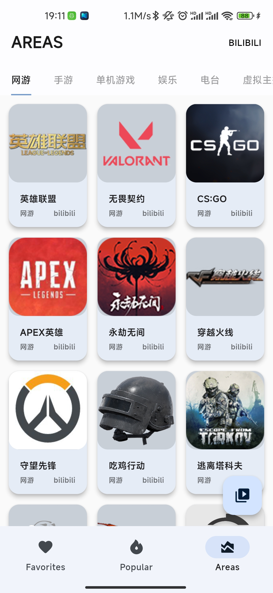
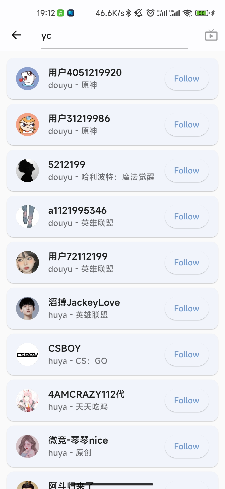
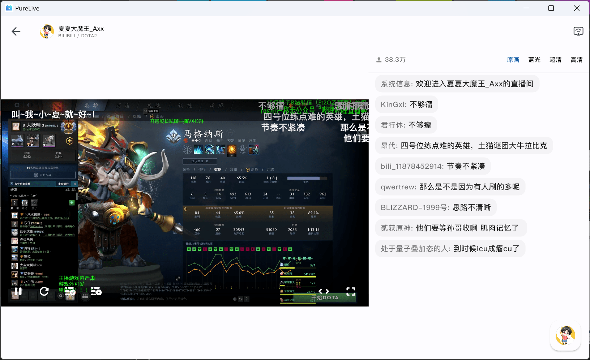

# Pure Live

Pure Live is a live stream transcoding application based on Flutter for android and windows, which can make you watch lives with ease. All data fetched by local machine, no cloud save, all live data and video belongs to original platform.

Pure Live是一款款平台基于Flutter的直播转码软件，轻松看直播。所有数据均由本地机器获取，不存储在云端，直播数据、视频版权归原平台所有。

目前支持设备:
- Android
- Windows

## Windows 安装

## 开发进度看板[link](https://jackiu-notes.notion.site/50bc0d3d377445eea029c6e3d4195671?v=663125e639b047cea5e69d8264926b8b)

## Screenshots

### Mobile UI

  <table>
    <tr>
    <td style="text-align: center">
      
    </td>
    <td style="text-align: center">
      
    </td>
    <td style="text-align: center">
      
    </td>
    <td style="text-align: center">
      
    </td>
    <td style="text-align: center">
      
    </td>
    </tr>
  </table>

### Tablet/Desktop UI

  <table>
    <tr>
    <td style="text-align: center">
      
    </td>
    <td style="text-align: center">
      
    </td>
    <td style="text-align: center">
      
    </td>
    </tr>
  </table>

## Platforms

- [x] [哔哩哔哩](https://app.bilibili.com/)

- [x] [虎牙APP](https://www.huya.com/download/)

- [x] [斗鱼APP](https://www.douyu.com/client)

## Donate

如果你觉得该项目对您有所帮助，可以打赏一杯咖啡给我，支持我继续开发维护PureLive。
感谢您的支持~

  <table>
    <tr>
    <td style="text-align: center">
      
    </td>
    <td style="text-align: center">
      
    </td>
    </tr>
  </table>

## Problems

### 问题反馈

- 如果需要反馈问题，请在Github发布[issue](https://github.com/Jackiu1997/pure_live/issues/new/choose)

### 部分链接无法播放

- 对于部分IP，哔哩哔哩的`.flv`格式的直播流无法播放，尝试使用`.m3u8`格式的直播流

### 搜索哔哩哔哩直播间不工作

- 哔哩哔哩官方搜索接口需要使用cookie，请在设置中自行设置自己的cookie

### 不定时更新（随缘开发）
如果你想要更好的用户体验，更人性化的交互设计，更稳定的使用，可以使用[哔哩哔哩APP](https://app.bilibili.com/)，[斗鱼APP](https://www.douyu.com/client)，[虎牙APP](https://www.huya.com/download/)

## Statement
This project is only for learning and communication. Please do not use it for commercial purposes. The copyright of related resources is owned by the original company.

这个项目仅作为个人兴趣业余开发，不用于商业用途。相关资源的版权归原公司所有。

No user privacy is ever collected, the app directly requests the official interface except for detection updates, and the data generated by all operations is kept locally by the user.

本项目是一个纯本地直播转码应用，不会收集任何用户隐私，应用程序直接请求直播官方接口，所有操作生成的数据由用户本地保留。

## Thanks
 - [ice_live_viewer](https://github.com/iiijam/ice_live_viewer)
 - [JustLive-Api](https://github.com/guyijie1211/JustLive-Api)
 - [real-url](https://github.com/wbt5/real-url)
 - [dart_tars_protocol](https://github.com/xiaoyaocz/dart_tars_protocol)
 - [bilibili-API-collect](https://github.com/SocialSisterYi/bilibili-API-collect)
 - [alltv_flutter](https://github.com/Ha2ryZhang/alltv_flutter)
